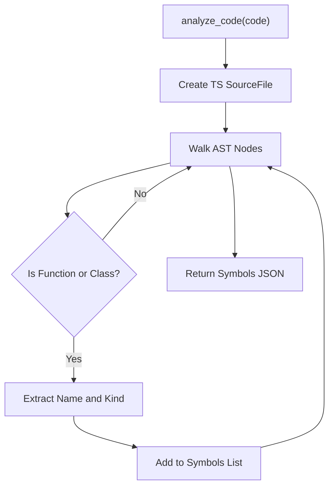

# Code Analyzer MCP Implementation

## Visual Map (Mermaid)

## API Documentation

### Tools

#### `analyze_code`
Parses the input code using the TypeScript Compiler API and extracts all function and class declarations.
- **Input**: `code` (string)
- **Output**: JSON array of symbols with `name`, `kind`, and `line`.

#### `generate_mermaid`
Scans the code for `if` statements and generates a Mermaid.js compatible flowchart representing the conditional logic.
- **Input**: `code` (string)
- **Output**: Mermaid flowchart string.

#### `extract_jsdoc`
Extracts JSDoc comments attached to functions, classes, and methods.
- **Input**: `code` (string)
- **Output**: JSON array of objects containing `symbol` and `comment`.
